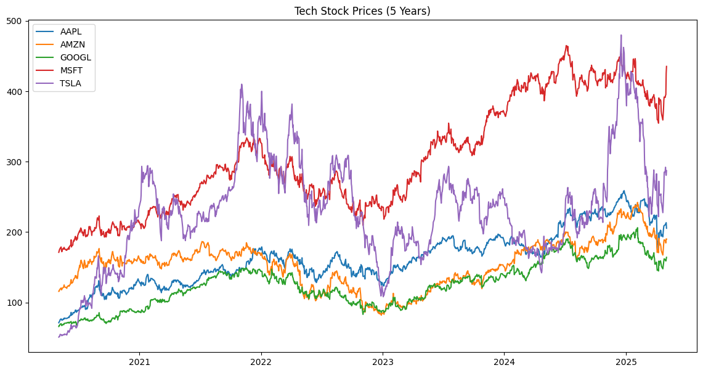
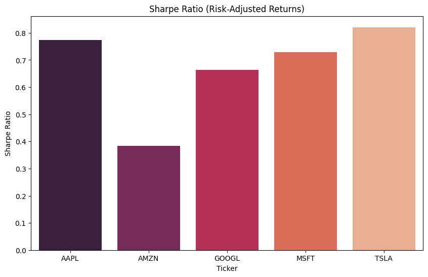

# Tech Stock & Macroeconomic Analysis (5-Year EDA)

  
*Analyzing tech stock performance alongside macroeconomic trends (2020–2025).*

## Overview
This project explores the risk-return profiles of **5 major tech stocks** (AAPL, MSFT, GOOGL, AMZN, TSLA) over 5 years, integrating macroeconomic data (Federal Funds Rate) to uncover relationships between market trends and monetary policy. Built with Python and Jupyter Notebook, it demonstrates skills in data analysis and visualization.

**Key Features**:
- **Data Collection**: Live stock prices (Yahoo Finance) and Federal Funds Rate (FRED API).
- **Risk Metrics**: Volatility, Sharpe Ratio, CAPM Beta.
- **Visualizations**: Matplotlib/Seaborn charts for trends, correlations, and risk analysis.

---

## Project Structure
stock-macro-eda/
├── data/ # Stock prices and macroeconomic data (CSV)
├── visuals/ # Visualizations (PNG)
├── notebooks/
│ └── analysis.ipynb # Jupyter Notebook with full analysis
├── configure.py # FRED API key (gitignored)
├── configure_template.py # Template for API setup
├── requirements.txt # Dependencies
└── README.md

---

## Installation (For Users Cloning Your Repo)
1. **Clone the Repository**:
   ```bash
   git clone https://github.com/Nihar-24/stock-macro-eda.git
   cd stock-macro-eda

2.  pip install -r requirements.txt

3. Set Up FRED API Key:

Get a free API key from FRED.

Create configure.py in the root directory:
# configure.py
FRED_API_KEY = "your_api_key_here"

## Usage
jupyter notebook notebooks/analysis.ipynb
Execute cells sequentially to:

-Fetch stock/macro data

-Generate visualizations

-Calculate financial metrics
## Results
1. Price Trends (5 Years)


What It Shows:

Raw (non-normalized) closing prices of tech stocks from 2021–2025.

Key Insight:

TSLA dominance: Exponential growth, rising from ~
100
t
o
100to500+ by 2025.

AMZN volatility: Sharp post-pandemic swings, peaking in 2023 before stabilizing.

2. Volatility Analysis


What It Shows:

Annualized standard deviation of daily returns (σ × √252 trading days).

Key Insight:

TSLA = High risk: Most volatile stock (σ = 55%), reflecting its growth-focused profile.

GOOGL = Stability: Lowest volatility (σ = 22%) among tech giants.

3. Correlation Heatmap


What It Shows:

Correlation coefficients between tech stock returns and Federal Funds Rate over 5 years.

Values range from -1 (perfect inverse) to +1 (perfect positive).

Key Insight:

Negative correlations: Rising interest rates (Fed Rate ↑) generally correlate with declining stock returns (e.g., TSLA: -0.25, AMZN: -0.27).

Sector sensitivity: Tech stocks (growth-oriented) are more impacted by rate hikes than defensive sectors.


4. CAPM Beta (AAPL vs. Market)


What It Shows:

Plots AAPL's daily returns (y-axis) against the S&P 500 (SPY) market returns (x-axis).

The red regression line represents AAPL’s sensitivity to market movements.

Key Insight:

Beta = 1.25: AAPL is 25% more volatile than the broader market.

When the market (SPY) rises/falls by 1%, AAPL tends to rise/fall by 1.25%

5. Sharpe Ratios




What It Shows:

Annualized standard deviation of daily returns (σ × √252 trading days).

Key Insight:

TSLA = High risk: Most volatile stock (σ = 55%), reflecting its growth-focused profile.

GOOGL = Stability: Lowest volatility (σ = 22%) among tech giants.

6. Macro Impact (Fed Rate vs. Stocks)


What It Shows:

Normalized stock prices (left axis) vs. Federal Funds Rate (right axis) from 2021–2025.

Stocks are indexed to 1 at the starting point (2021) for fair comparison.

Key Insight:

Inverse relationship: Rising interest rates (2022–2023) correlate with stock price declines (e.g., AMZN, TSLA).

TSLA’s resilience: Despite rate hikes, TSLA maintained stronger growth than peers.